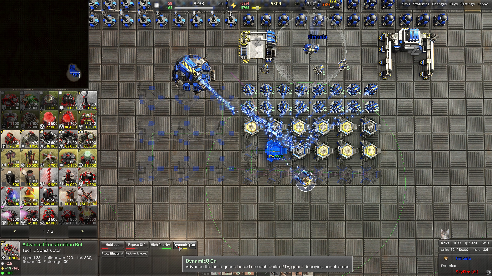

# Auto Draw a Grid for NuttyB Raptor

When ingame press F11 then scroll to the bottom to turn on then turn off, the widget will draw automatically, there's no shortcut or key.

It will check if you're playing Full Metal Plate map or not.

[Download Auto Draw Grid](https://github.com/timuela/BAR-widgets/blob/main/auto_draw_grid.lua)

# Dynamic Queue

Dynamically chain-advances your builder's queue based on each build's ETA: the widget measures real build speed and shifts the advance threshold on the fly — quick to move on from short builds, more patient with long ones.

Toggle it from the builder's command menu; it cycles through three modes:

Off

On: automatic. The advance threshold adapts to each nanoframe's remaining ETA: under ~5s it advances immediately, under ~15s at 30%, under ~25s at 60%, longer builds at 90%.

On also hands the nanoframe off: it pulls a nearby free nano turret onto the nanoframe, and only advances once a nano turret is actually assisting, so the frame still gets finished.

Decay guard: it tracks the nanoframes in the builder's own queue and watches their build rate. A decaying nanoframe is prioritized, and once the builder is free it inserts a repair order to rescue it before moving on.

YOLO: no guards at all. It advances the moment a nanoframe is under way, ignoring ETA, threshold, progress and whether anything is assisting — rapid-fire placing, leaving the frames where they land. A builder you explicitly put on hold still stays held.

[Download Dynamic Queue](https://github.com/timuela/BAR-widgets/blob/main/dynamic_queue.lua)

# Auto Dgun for nuttyb raptor

**What it does**

- Makes your commander auto-DGun dangerous enemies in range (600)

**Targets**

- Raptor Queens
- Penguin
- Mini-queens
- Matrona (basic, fire, electric, acid)
- Doom Bringers.

**Features**

- Toggle Auto DGun On/Off in the command menu
- Works only with commanders
- Checks every 0.5s
- Console feedback when commander fires

**Cons**

- Fires at the position, not the target → if Repeat is ON, your commander may keep DGunning even after the target is dead
- Will not discriminate → your neighbor’s units could get fried if they’re in the way

[Download Auto DGun](https://github.com/timuela/BAR-widgets/blob/main/auto_dgun.lua)

# Queen Ping for nuttyb raptor

**What it does**

- Automatically **pings the map** when a **Raptor Queen dies**
- Shows a **red marker** with the text: _“Raptor Queen Killed!”_

**Targets**

- **Raptor Queens**

**Features**

- Clear **visual ping** at the exact death location
- Helps your team **know how many queens was killed at your doorstep**

**Why use it?**

- Clout farming "**Yay i killed 4 queens**"

[Download Queen Ping](https://github.com/timuela/BAR-widgets/blob/main/queen_ping.lua)

